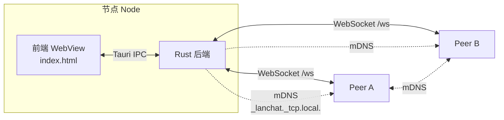

# LAN Chat

> 纯局域网即时通讯 + 剪贴板共享的桌面应用。无外部服务器、无账号、无云端，流量不出本地网络。


## 功能

- 💬 **实时聊天** — Axum WebSocket，低延迟，消息在所有在线设备间广播
- 📋 **剪贴板一键分享** — 桌面端把系统剪贴板内容广播给其他设备
- 🔎 **自动发现** — mDNS 服务注册与浏览，零配置组网
- 🌑 **现代深色 UI** — Tauri WebView，桌面窗口，移动端尺寸自适应
- 💾 **内存消息缓存** — 最近 200 条，重启清空（保护隐私）
- 🛡️ **去重防回环** — 500 条 ID 滑动窗口，P2P 广播不形成环路
- 🌐 **纯局域网** — 默认监听 `0.0.0.0:4242`，仅在同一 LAN 互通

## 架构



- **mDNS 发现**：每个节点把 `_lanchat._tcp.local.` 服务注册到本地网络，浏览器（监听端）发现后自动反向连接
- **WebSocket 通信**：所有消息走 `/ws` 路径，先交换 `hello` 握手（`node_id` / `nickname` / `version`），再交换消息
- **Tauri IPC**：前端通过 `window.__TAURI__.core.invoke` 调用 Rust 命令，通过 `window.__TAURI__.event.listen` 接收后端事件

## 系统要求

| 工具 | 版本 | 用途 |
|---|---|---|
| **Rust** | 1.75+ stable | 编译后端 + Tauri CLI |
| **Tauri 平台依赖** | 见下表 | WebView、系统库 |

### 平台依赖

**macOS**
```bash
xcode-select --install
# 即可，macOS 自带系统 WebKit
```

**Linux (Debian/Ubuntu)**
```bash
sudo apt update
sudo apt install -y libwebkit2gtk-4.1-dev build-essential curl wget file \
    libxdo-dev libssl-dev libayatana-appindicator3-dev librsvg2-dev
```
> Fedora / Arch 用户参考 Tauri 官方文档：[prerequisites](https://tauri.app/start/prerequisites/)

**Windows**
- 安装 [Microsoft Visual Studio C++ Build Tools](https://visualstudio.microsoft.com/visual-cpp-build-tools/)
- 安装 WebView2 Runtime（Win11 自带；Win10 需手动装）

## 快速开始

```bash
# 1. 克隆
git clone https://github.com/EarthTan/lan-chat.git
cd lan-chat

# 2. 安装 Tauri CLI（仅首次需要，装一次全局可用）
cargo install tauri-cli --version "^2.0" --locked

# 3. 开发模式：编译 Rust + 启动桌面窗口
cargo tauri dev
```

首次编译会拉取并编译 Tauri / Axum / mdns-sd 等依赖，请耐心等（5-15 分钟取决于网络与机器）。

## 构建发布版本

```bash
cargo tauri build
```

产物在 `src-tauri/target/release/bundle/`：

| 平台 | 产物 |
|---|---|
| macOS | `.app`（拖入 `/Applications`）和 `.dmg` |
| Linux | `.deb` / `.AppImage` / `.rpm`（取决于系统） |
| Windows | `.msi` 和 `.exe` |

## 端口

WebSocket 服务器默认尝试绑定 `4242-4252` 范围（`src-tauri/src/server.rs`），端口被占用时自动递增。
同一台机器可运行多个实例，**仅限同一 LAN 内访问**。

## 协议概要

WebSocket 上的所有消息都是 JSON。完整协议见 [`docs/PROTOCOL.md`](docs/PROTOCOL.md)。

```
客户端 → 服务端:  {"type":"hello","node_id":"<uuid>","nickname":"Alice","version":"1"}
服务端 → 客户端:  {"type":"hello","node_id":"<uuid>","nickname":"Bob","version":"1"}
双方:             {"id":"1719666000000_abc12","text":"hi","device":"Alice",
                   "type":"text","ts":1719666000000}
```

## 项目结构

```
lan-chat/
├── frontend/               # 前端：单个 index.html（被 Tauri 直接加载，无打包）
│   └── index.html
├── src-tauri/              # Rust 后端
│   ├── src/
│   │   ├── main.rs         # 入口：启动 Tauri App
│   │   ├── lib.rs          # run()：装配所有模块
│   │   ├── commands.rs     # Tauri IPC 命令（前端 invoke 的入口）
│   │   ├── server.rs       # Axum WebSocket 服务端（处理入站连接）
│   │   ├── mdns.rs         # mDNS 服务注册 + 浏览器（自动发现）
│   │   ├── peers.rs        # PeerPool：所有连接的状态管理
│   │   ├── messages.rs     # Message 结构 + MessageStore（200 条环形缓冲）
│   │   └── network.rs      # 列出本机网络接口
│   ├── tauri.conf.json     # Tauri 窗口/打包配置（frontendDist 指向 ../frontend）
│   ├── Cargo.toml
│   ├── Cargo.lock
│   └── build.rs
├── docs/
│   ├── ARCHITECTURE.md     # 模块拆解与数据流
│   └── PROTOCOL.md         # WebSocket / IPC 协议
└── .gitignore
```

## 已知限制

- **消息不持久化**：进程退出后 200 条历史丢失（设计如此，保护隐私）
- **mDNS 受网络影响**：AP 隔离的 WiFi、企业网络的组播策略可能阻断 mDNS
- **手动连接作为兜底**：若 mDNS 不通，可在 UI 里手动输入 `IP:端口` 连接到对端
- **首次 Rust 编译慢**：Tauri + WebKit 依赖较重；之后增量编译很快
- **不支持端到端加密**：同一 LAN 内明文 WebSocket；如需更安全请自行加 TLS 层

## 调试

- 前端 DevTools：Tauri 窗口内默认可以右键 → Inspect Element（或开发模式下自动打开）
- Rust 日志：使用 `tracing`，设置 `RUST_LOG=lanchat=debug` 看到详细日志
  ```bash
  RUST_LOG=lanchat=debug cargo tauri dev
  ```

## 贡献

欢迎 PR 和 Issue。本地开发前请运行 `cargo check` 确认环境正常。

## 许可

待定。
