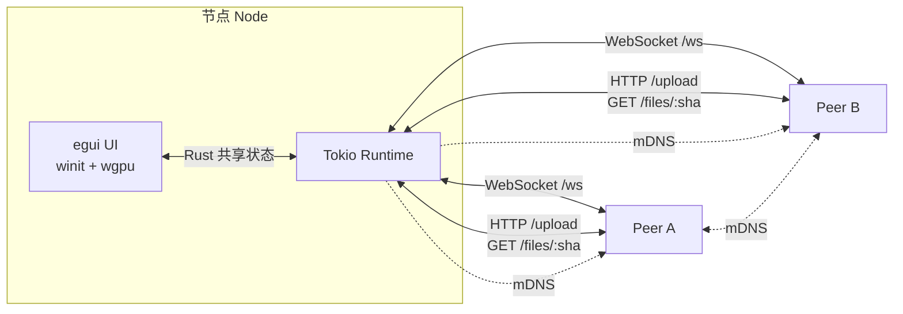

# LAN Chat

> 纯局域网即时通讯 + 剪贴板共享 + 文件传输的桌面应用。无外部服务器、无账号、无云端，流量不出本地网络。


## 功能

- 💬 **实时聊天** — Axum WebSocket，低延迟，消息在所有在线设备间广播
- 📋 **剪贴板一键分享** — 桌面端把系统剪贴板内容广播给其他设备
- 📎 **文件传输** — 任意大小，SHA-256 内容寻址去重，拖入或点击发送
- 🔎 **自动发现** — mDNS 服务注册与浏览，零配置组网
- 🌑 **现代深色 UI** — 纯 Rust 原生窗口（egui + wgpu），无 WebView、无 JavaScript
- 💾 **内存消息缓存** — 最近 200 条，重启清空（保护隐私）
- 🛡️ **去重防回环** — 500 条 ID 滑动窗口，P2P 广播不形成环路
- 🌐 **纯局域网** — 默认监听 `0.0.0.0:4242`，仅在同一 LAN 互通

## 架构



- **mDNS 发现**：每个节点把 `_lanchat._tcp.local.` 服务注册到本地网络，浏览器（监听端）发现后自动反向连接
- **WebSocket 通信**：所有控制消息走 `/ws` 路径（聊天 / 剪贴板 / 文件元数据），先交换 `hello` 握手，再交换消息
- **HTTP 文件传输**：文件 body 走 `/upload`（POST）和 `/files/:sha256`（GET），由 WebSocket 通道广播 SHA-256 元数据
- **单一 Rust 进程**：UI（egui）渲染、HTTP/WS（axum）、mDNS（mdns-sd）、文件哈希、剪贴板（arboard）— 全部 Rust 库，无 IPC、无 WebView

## 系统要求

| 工具 | 版本 | 用途 |
|---|---|---|
| **Rust** | 1.75+ stable | 编译全部 |
| **平台 GUI 依赖** | 见下表 | winit + wgpu 系统库 |

### 平台依赖

**macOS**
```bash
xcode-select --install
# 即可，macOS 自带系统 Metal
```

**Linux (Debian/Ubuntu)**
```bash
sudo apt update
sudo apt install -y build-essential pkg-config libxcb-render0-dev libxcb-shape0-dev libxcb-xfixes0-dev libssl-dev
```
> 桌面环境：X11 或 Wayland（自动检测）

**Windows**
- 安装 [Microsoft Visual Studio C++ Build Tools](https://visualstudio.microsoft.com/visual-cpp-build-tools/)
- Windows 10+ 自带 DirectX 12（wgpu 后端）

## 快速开始

```bash
# 1. 克隆
git clone https://github.com/EarthTan/lan-chat.git
cd lan-chat

# 2. 开发模式
cd src-tauri
cargo run

# 3. 发布构建
cargo build --release
# 产物：src-tauri/target/release/lan-chat
```

首次编译会拉取并编译 eframe / wgpu / axum / mdns-sd 等依赖，请耐心等（5-15 分钟取决于网络与机器）。

## 项目结构

```
lan-chat/
└── src-tauri/                  # 整个应用（单一 crate）
    ├── Cargo.toml
    └── src/
        ├── main.rs             # 入口：lan_chat_lib::run()
        ├── lib.rs              # 装配：tokio runtime + axum + eframe
        ├── app.rs              # eframe::App（整个 UI 树）
        ├── commands.rs         # 后端操作（普通 async fn，不再 #[tauri::command]）
        ├── server.rs           # axum HTTP/WS server + UiEvent mpsc
        ├── mdns.rs             # mDNS 服务注册 + 浏览器
        ├── peers.rs            # PeerPool
        ├── messages.rs         # Message / MessageStore / FileMeta
        ├── network.rs          # 网络接口枚举
        ├── transfer.rs         # 文件 body 缓存（sha256 索引）
        └── ui/
            ├── theme.rs        # 颜色/字体/间距/字号 token（8px 网格 + 单一等宽）
            ├── setup.rs        # 启动 setup overlay
            ├── clip_modal.rs   # 剪贴板分享弹窗
            └── file_card.rs    # 文件消息卡片
```

## 协议概要

WebSocket 上的所有消息都是 JSON。完整协议见 [`docs/PROTOCOL.md`](docs/PROTOCOL.md)。

```
客户端 → 服务端:  {"type":"hello","node_id":"<uuid>","nickname":"Alice","version":"1"}
服务端 → 客户端:  {"type":"hello","node_id":"<uuid>","nickname":"Bob","version":"1"}
双方:             {"id":"1719666000000_abc12","text":"hi","device":"Alice",
                   "type":"text","ts":1719666000000}
文件消息:
双方:             {"id":"...","text":"[file] foo.png (1024 B)","device":"Alice",
                   "type":"file","ts":...,
                   "file":{"sha256":"...","filename":"foo.png","size":1024,"addr":"192.168.1.5:4242"}}
```

## 调试

```bash
RUST_LOG=lan_chat=debug cargo run
```

## 许可

待定。
