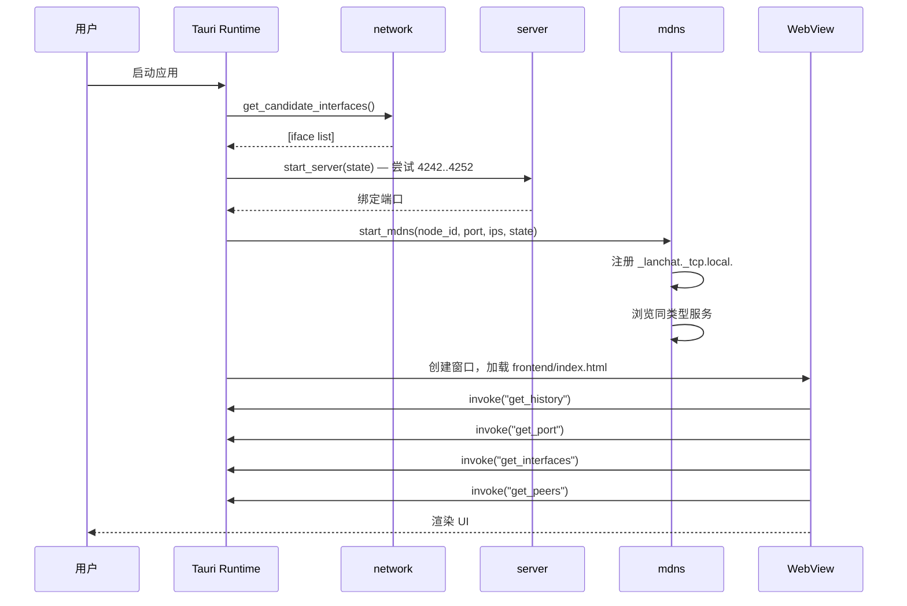
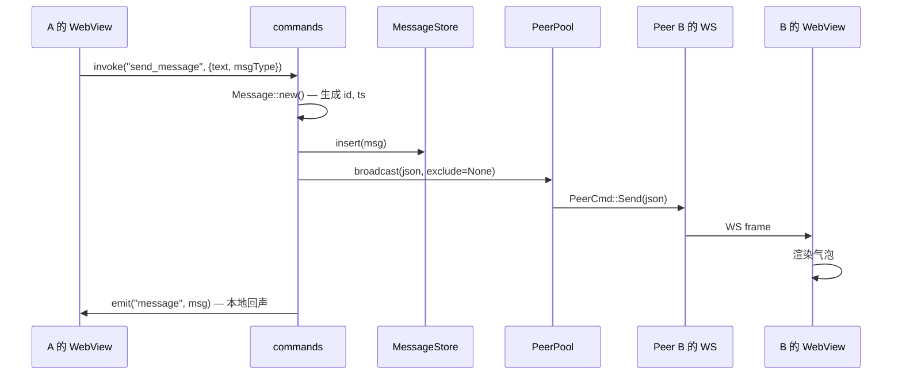
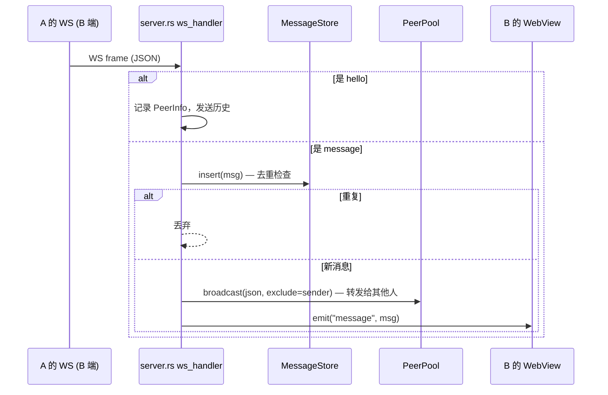

# Architecture

> LAN Chat 的模块拆解、数据流与并发模型。

## 总体设计

LAN Chat 是一个 **Tauri 2 桌面应用**，分两层：

- **前端（WebView）**：单个 `frontend/index.html`，原生 JS，零打包。通过 Tauri 提供的 `window.__TAURI__` 全局对象与 Rust 后端通信。
- **后端（Rust）**：`src-tauri/src/` 下的多个模块协作，负责 WebSocket 服务、mDNS 发现、连接池、消息存储。

进程边界由 Tauri 管理；前后端在同一个进程内，IPC 走 `invoke`（请求-响应）和 `emit/listen`（事件推送）。

## 模块一览

| 模块 | 职责 | 关键类型 |
|---|---|---|
| `main.rs` | 进程入口，调用 `lib::run()` | — |
| `lib.rs` | 装配 Tauri App，注册状态和命令 | `run()` |
| `commands.rs` | Tauri IPC 命令，前端 `invoke` 的目标 | `AppState` |
| `server.rs` | Axum HTTP/WS 服务，处理入站 WS 连接 | `ServerState`, `start_server()` |
| `mdns.rs` | mDNS 服务注册 + 浏览器，发现对端 | `start_mdns()` |
| `peers.rs` | 全局连接池（inbound + outbound 统一管理） | `PeerPool`, `PeerInfo` |
| `messages.rs` | 消息结构 + 内存环形缓冲 + 去重 | `Message`, `MessageStore` |
| `network.rs` | 列出本机网络接口（前端展示用） | `NetworkInterface` |

## 启动流程



## 消息数据流

### 发送（用户 A）



### 接收（用户 B）



## 并发模型

后端是 **Tokio runtime**（通过 Tauri 启动），所有 I/O 全异步：

- **WebSocket 服务**：`axum::serve` 在独立任务中运行
- **mDNS 浏览器**：`mdns_sd::ServiceDaemon::browse` 在独立任务中
- **每个 peer 一个写任务**：`mpsc::UnboundedSender<PeerCmd>` → 写任务 → WebSocket sink
  - 通过 channel 而不是共享 `Mutex<SplitSink>` 序列化写操作，避免锁
- **消息存储**：`std::sync::Mutex`（阻塞锁）。访问极短（仅 push/drain/clone 200 条），不阻塞 Tokio 调度
- **PeerPool**：`dashmap`，按 `node_id` 分片，无需全局锁

## 状态共享

```rust
// lib.rs 中
let pool = PeerPool::new();           // Arc<DashMap>
let store = Arc::new(MessageStore::new());
let node_id = Uuid::new_v4().to_string();
let nickname = Arc::new(RwLock::new(default));

let server_state = ServerState { pool, store, node_id, nickname, app };

// 启动 WS + mDNS（克隆 state）
start_server(server_state.clone()).await?;
start_mdns(node_id, port, ips, server_state.clone())?;

// 注册给 Tauri，供 commands 访问
app.manage(AppState { server_state, port });
```

`Arc<Clone>` 是后端状态共享的全部机制——所有模块都拿到同一份 `ServerState` 的克隆。

## 关键不变量

1. **同一 node_id 不会双重连接**：`PeerPool::add` 通过 `node_id` 去重
2. **消息不形成广播环路**：转发时 `exclude_node_id` 排除发送方
3. **消息不重复存储**：`MessageStore::insert` 在 500 条 ID 滑动窗口内去重
4. **消息不会无限增长**：`MAX_MESSAGES = 200` 环形缓冲
5. **同 IP 不会因多网卡重复注册**：每个接口 IP 用不同 instance name（`lanchat-{short_id}-{ip_dashed}`）

## Tauri IPC 命令清单

| 命令 | 方向 | 用途 |
|---|---|---|
| `get_history` | FE → BE | 拉取最近 200 条消息 |
| `send_message` | FE → BE | 发送一条消息 |
| `get_peers` | FE → BE | 获取当前已连接对端列表 |
| `connect_peer` | FE → BE | 手动按 IP:port 连接对端（mDNS 兜底） |
| `get_interfaces` | FE → BE | 本机网络接口列表（UI 展示） |
| `get_port` | FE → BE | 当前绑定的 WS 端口 |
| `get_nickname` | FE → BE | 当前设备昵称 |
| `set_nickname` | FE → BE | 修改设备昵称 |

后端向前端推送：

| 事件 | payload | 用途 |
|---|---|---|
| `message` | `Message` | 新消息到达（本地或远端） |
| `peers` | `Vec<PeerInfo>` | 对端列表变化（可选） |
